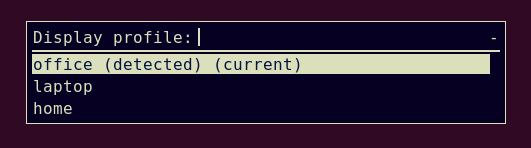

Intro

<!--more-->

== autorandr

Install:

    # apt install autorandr

Or:

    $ pip install autorandr

Simple run:

    $ autorandr
    office (detected) (current)
    home
    laptop

Save:

    $ autorandr --save config_name

Load:

    $ autorandr --load config_name

Load auto:

    $ autorandr --change

== rofi

Install:

    # apt install rofi

Auto:

    $ cat display-profile-auto.sh
    #!/usr/bin/env sh
    autorandr --change

Manual:

    $ cat display-profile-menu.sh
    #!/usr/bin/env sh
    # Check requirements
    command -v autorandr >/dev/null 2>&1 || { echo >&2 "Command requires: autorandr. Aborting."; exit 1; }
    command -v rofi >/dev/null 2>&1 || { echo >&2 "Command requires: rofi. Aborting."; exit 1; }
    # Start
    autorandr | rofi -dmenu -width 25 -no-fixed-num-lines -no-custom -p "Display profile" | awk '{print $1}' | xargs autorandr --load

Result:

