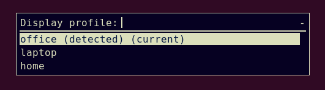

При работе (особенно если у тебя ноутбук и ты им пользуешься в разных локациях) бывает нужно переключаться между разными конфигурациями мониторов.
Сюда входит их разрешение, взаимное расположение и статус (вкл/выкл).
Обычно система умеет самостоятельно изменять профиль отображения при подключении и отключении дисплеев, но часто это не соответствует тому, что хочется, и приходится вручную настраивать профиль через параметры мониторов в системе.
Но можно упростить и автоматизировать этот процесс с помощью утилиты `autorandr`, которая умеет запоминать и (автоматически) применять настройки мониторов.
А с помощью Rofi можно создать удобное меню для ручного переключения между профилями.

<!--more-->

## autorandr

[autorandr](https://github.com/phillipberndt/autorandr) -- это удобная утилита, которая может сохранять информацию о конфигурации мониторов от `xrandr` в отдельные профили и применять их (вручную, или автоматически определяя подходящий профиль).
Для определения мониторов используется его идентификатор [EDID](https://en.wikipedia.org/wiki/Extended_Display_Identification_Data), т.е. корректно определяются разные мониторы, даже если они подключаются к одному порту.

Устанавливаем `autorandr` из репозитория (deb-based дистрибутив Linux):

    # apt install autorandr

Либо из PyPI:

    $ pip install autorandr

При запуске команды `autorandr` она выведет список сохранённых профилей (current -- текущий профиль, detected -- подходящий под текущие подключённые устройства):

    $ autorandr
    office (detected) (current)
    home
    laptop

Для создания профиля нужно подключить и настроить мониторы и выполнить команду `--save`:

    $ autorandr --save config_name

Для загрузки конкретного профиля используется команда `--load`:

    $ autorandr --load config_name

Или можно использовать команду `--change`, чтобы автоматически выбрать и установить подходящий профиль:

    $ autorandr --change

Команд `--load` и `--change` достаточно для управления профилями. Можно запускать их из терминала или повесить на хоткей. Например, создать скрипт `display-profile-auto.sh`:

```sh
#!/usr/bin/env sh
autorandr --change
```

Так же удобно добавить выполнение `--change` в стартовый скрипт своего WM/DE, например в `~/.xinitrc`, чтобы автоматически загружать нужный профиль при запуске графической системы.

## Rofi

Для удобного ручного переключения между профилями можно создать диалоговое окно с выбором профиля в [Rofi](https://github.com/davatorium/rofi). Мы будем использовать Rofi как генератор меню для выбора нужного профиля.

Устанавливаем Rofi из репозитория:

    # apt install rofi

Создаём скрипт `display-profile-menu.sh`:

```sh
#!/usr/bin/env sh
autorandr \
  | rofi -dmenu -width 25 -no-fixed-num-lines -no-custom -p "Display profile" \
  | awk '{print $1}' \
  | xargs autorandr --load
```

Он выводит меню с заголовком "Display profile" и списком доступных профилей. Можно выбирать профиль стрелками с клавиатуры, а так же фильтровать значения по введённому тексту. Итоговое меню выглядит так:



Цвета, стиль и функции меню можно настраивать (см. документацию Rofi).

Скрипт так же можно повесить на хоткей. У меня в системе есть 2 хоткея -- для `display-profile-auto.sh` и `display-profile-menu.sh` -- автоматическое и ручное переключение профилей мониторов.

